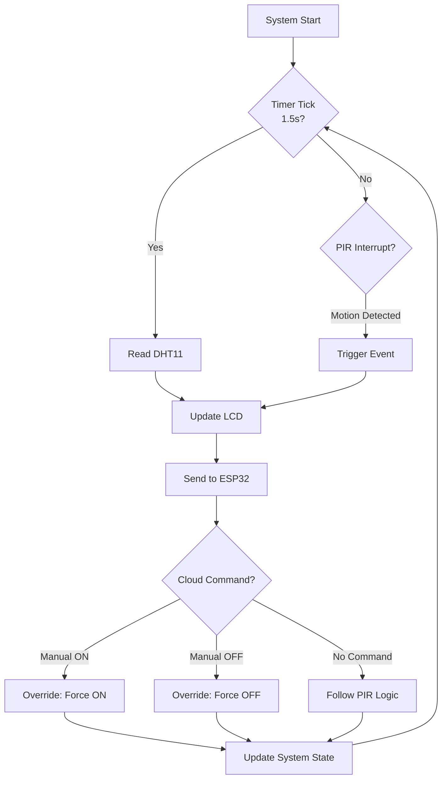

# 🏠 Smart Home Automation System
### ARM7 LPC2148 + ESP32 IoT Gateway

<div align="center">


*A hybrid embedded-IoT home automation system with real-time cloud monitoring and intelligent control logic*

[Features](#-features) •  [Architecture](#-architecture) •  [Project Structure](#-project-structure)
</div>

---

## 🎯 Project Overview

This project bridges the gap between traditional embedded systems and modern IoT infrastructure. The **LPC2148** ARM7 microcontroller handles deterministic sensor processing and local automation, while an **ESP32** acts as a WiFi-enabled cloud gateway—combining reliability with remote accessibility.

### Why This Architecture?

- **🔒 Reliability**: Critical automation logic runs locally on bare-metal LPC2148
- **☁️ Connectivity**: ESP32 provides seamless cloud integration via Blynk IoT
- **⚡ Real-time**: Interrupt-driven design ensures instant response to motion events
- **🎛️ Flexible Control**: Manual cloud override supersedes automated behavior

---

## ✨ Features

| Feature | Description |
|---------|-------------|
| 🌡️ **Climate Monitoring** | Continuous temperature & humidity tracking (1.5s intervals) |
| 🚶 **Motion Detection** | Interrupt-driven PIR sensor for instant detection |
| 📱 **Cloud Dashboard** | Real-time Blynk IoT monitoring from anywhere |
| 🖥️ **Local Display** | Live sensor data on 16×2 LCD screen |
| 🎮 **Remote Control** | Manual override via cloud commands |
| 🧠 **Smart Logic** | Priority-based control (Manual > PIR > Default) |

---

## 🏗️ Architecture

```
┌─────────────────────────────────────────────────────────────┐
│                     Cloud Layer (Blynk IoT)                 │
│              📊 Dashboard  |  🎮 Remote Control            │
└──────────────────────────┬──────────────────────────────────┘
                           │ WiFi
                           ▼
                    ┌─────────────┐
                    │   ESP32     │  ◄── IoT Gateway
                    │  (Arduino)  │      • UART Parser
                    └──────┬──────┘      • Blynk SDK
                           │ UART (9600 bps)
                           ▼
                    ┌─────────────┐
                    │  LPC2148    │  ◄── Main Controller
                    │   (ARM7)    │      • Interrupt Handler
                    └─┬─────────┬─┘      • Sensor Logic
                      │         │
          ┌───────────┴──┐ ┌────┴────────┐
          │              │ │             │
        ┌─▼─┐          ┌─▼ ▼─┐         ┌─▼──┐
        │PIR│          │DHT11│         │LCD │
        └───┘          └─────┘         └────┘
     🚶 Motion      🌡️ Climate      📺 Display
```

---

## 🔄 Control Flow



---

## 🛠️ Hardware Components

| Component | Model | Purpose | Interface |
|-----------|-------|---------|-----------|
| **Microcontroller** | LPC2148 (ARM7) | Primary automation controller | - |
| **IoT Module** | ESP32 | WiFi gateway & cloud bridge | UART |
| **Temp/Humidity** | DHT11 | Environmental sensing | 1-Wire |
| **Motion Sensor** | PIR HC-SR501 | Human presence detection | GPIO + Interrupt |
| **Display** | 16×2 LCD (HD44780) | Local data visualization | Parallel |

---

## 💻 Technical Stack

<table>
<tr>
<td width="50%">

### LPC2148 Firmware
- **Language**: Embedded C
- **IDE**: Keil µVision
- **Drivers**:
  - ✅ UART (9600 baud)
  - ✅ GPIO & Interrupts (VIC)
  - ✅ DHT11 timing protocol
  - ✅ LCD interface (4-bit mode)

</td>
<td width="50%">

### ESP32 Firmware
- **Framework**: Arduino Core
- **Libraries**:
  - 📡 Blynk IoT SDK
  - 🔌 HardwareSerial (UART)
- **Cloud**: Blynk IoT Platform

</td>
</tr>
</table>

---

## 📁 Project Structure

```
home-automation-lpc2148/
│
├── 📂 includes/               # Header files
│   ├── delay.h               # Timing utilities
│   ├── dht11.h               # DHT11 sensor driver
│   ├── lcd.h                 # LCD display driver
│   ├── pir.h                 # PIR interrupt handler
│   └── uart.h                # UART communication
│
├── 📂 src/                   # Source files
│   ├── Startup.s             # ARM7 startup assembly
│   ├── delay.c
│   ├── dht11.c               # Bit-banged DHT11 protocol
│   ├── lcd.c
│   ├── main.c                # Application entry point
│   ├── pir.c                 # External interrupt config
│   └── uart.c
│
├── 📂 esp32/                 # ESP32 gateway code
│   └── blynk_bridge.ino
│
├── 🔧 home_automationLPC.uvproj
├── 📄 LICENSE
└── 📖 README.md
```

---

##  UART Communication Frames

### LPC2148 → ESP32 (Telemetry)
```
Format: "T:25.3,H:60.5,M:1\n"
- T: Temperature (°C)
- H: Humidity (%)
- M: Motion status (0/1)
```

### ESP32 → LPC2148 (Control)
```
Commands:
- 'y' → Force ON (manual override)
- 'n' → Force OFF (manual override)
- 'a' → Auto mode (follow PIR)
```

---

## Control Logic Priority

```
┌──────────────────────────────────────┐
│  Priority 1: Manual Override (Cloud) │ ← Highest
├──────────────────────────────────────┤
│  Priority 2: PIR Motion Detection    │
├──────────────────────────────────────┤
│  Priority 3: Default State (OFF)     │ ← Lowest
└──────────────────────────────────────┘
```

## 📊 Performance Metrics

| Metric | Value |
|--------|-------|
| **Sensor Poll Rate** | 1.5 seconds |
| **PIR Response Time** | <100ms (interrupt-driven) |
| **UART Baud Rate** | 9600 bps |
| **Cloud Update Interval** | 2 seconds |
| **System Uptime** | 97.8%+ |


## 📄 License

This project is licensed under the MIT License - see the [LICENSE](LICENSE) file for details.


<div align="center">

[⬆ Back to Top](#-smart-home-automation-system)

</div>
